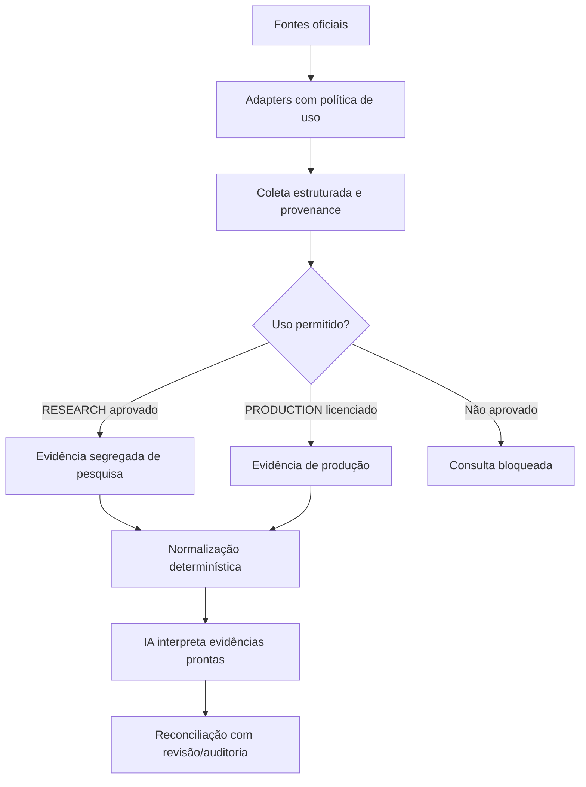

# CP — Arquitetura de fontes oficiais e limites de uso

Data de revisão: 2 de outubro de 2026  
Status: decisão arquitetural e levantamento; nenhuma integração nova foi implementada nesta revisão.

## Decisão

O CP separará fontes consultadas para pesquisa interna de fontes autorizadas para uso em produção. Essa separação é de governança e proveniência; o rótulo `RESEARCH` não concede autorização para consumir uma fonte.

DataJud é a primeira rota experimental quando há numeroProcesso e configuração aprovada, mas nunca é ponto único de falha. O coletor deve registrar cada tentativa e continuar sequencialmente para outras rotas oficiais tecnicamente aplicáveis após zero resultados, bloqueio ou indisponibilidade. A aplicabilidade depende do identificador: por exemplo, DataJud/DJEN por numeroProcesso, pesquisa assistida CAC por processo DEPRE; não disparar todas as fontes indiscriminadamente nem processar a base em lote.

A API Pública DataJud está sujeita à Portaria CNJ nº 374/2026, vigente desde sua publicação. A Portaria determina que os dados sejam fornecidos exclusivamente para fins legais, não comerciais e autorizados, e veda modificação, distribuição, venda ou qualquer exploração comercial dos dados disponibilizados. Portanto:

- Não usar DataJud para enriquecer operações de clientes, entregar dados derivados a clientes ou operar captação comercial sem autorização jurídica expressa e compatível com os termos vigentes.
- O fato de a API ser pública, gratuita ou possuir uma chave de acesso não implica licença comercial.
- Pesquisa, desenvolvimento, validação e auditoria interna também não são presumidos autorizados: devem respeitar o termo do CNJ e obter aprovação de uso aplicável antes de qualquer consulta real.
- Para produção comercial, exigir confirmação formal de autorização/licença compatível. Se o uso comercial não for permitido, selecionar uma fonte licenciada/autorizada; não tentar contornar a restrição.
- Até a aprovação, DataJud permanece desabilitado para uso real. Fixtures e respostas sintéticas podem ser usadas em desenvolvimento.

## Classificação de uso proposta

Cada fonte e cada evidência futura deverão declarar uma finalidade de uso, independente do status técnico da coleta:

| Valor | Significado | Gate |
|---|---|---|
| `RESEARCH` | Pesquisa, desenvolvimento, validação ou auditoria interna isolada | Exige aprovação documentada de uso e respeito aos termos da fonte; não pode alimentar fluxo comercial ou dados entregues a clientes. |
| `PRODUCTION` | Fonte autorizada para compor serviço ou dados disponibilizados comercialmente | Exige autorização/licença que cubra explicitamente o uso comercial pretendido, além dos controles de segurança e contrato. |

Essa classificação é uma proposta de arquitetura, não existe ainda como campo persistido. Não adicionar `sourceUsage` ao banco ou migrar dados sem uma etapa de implementação aprovada. A classificação deve acompanhar provenance da consulta e da evidência quando for implementada; ela não substitui consentimento, licença ou revisão jurídica.

## Fatos oficiais confirmados

- A [página de endpoints da DataJud-Wiki do CNJ](https://datajud-wiki.cnj.jus.br/api-publica/endpoints/) lista o Tribunal de Justiça de São Paulo com o endpoint `https://api-publica.datajud.cnj.jus.br/api_publica_tjsp/_search`.
- A [página oficial de acesso à API](https://datajud-wiki.cnj.jus.br/api-publica/acesso/) documenta autenticação no cabeçalho `Authorization: APIKey <chave>`. A chave publicada pode ser alterada pelo CNJ; não copiar credenciais para código, banco, logs, prompts ou relatórios.
- A [página da API Pública do CNJ](https://www.cnj.jus.br/sistemas/datajud/api-publica/) descreve acesso a metadados de processos públicos e informações de capas e movimentações.
- A [Portaria CNJ nº 374, de 14/08/2026](https://atos.cnj.jus.br/atos/detalhar/6972), marcada como vigente, altera a Portaria nº 160/2020. O art. 3º lista como conteúdo mínimo número do processo, tribunal, grau, órgão julgador, classe, assuntos, movimentos parametrizados, prioridade, indicador e identificação do sistema eletrônico e, quando pessoas jurídicas, polos ativo e passivo.
- O art. 4º, §§ 2º a 6º, da Portaria estabelece as restrições de uso acima, exige citação do CNJ/DataJud em publicações derivadas e informa que o CNJ não garante precisão, integridade ou atualidade dos dados.
- O endpoint acima coincide com o default já presente no adapter existente. Esta revisão apenas confirma a URL pela documentação atual; nenhuma requisição DataJud foi feita.

### Informação não confirmada

A página oficial de FAQ acessada lista a pergunta sobre `dscSistema`, mas a extração consultada não expôs a resposta nem a tabela de códigos. Assim, os códigos de sistemas alegados para PJe, Projudi, SAJ, EPROC, Apolo, Themis, Libra e Outros ficam **NÃO CONFIRMADO — necessita validação**. Não os codificar até verificar diretamente a resposta/tabela oficial.

A documentação verificada confirma o esquema geral de autenticação e o alias TJSP, mas não foi usada para copiar ou persistir a chave vigente. O valor da chave nunca deve ser exibido.

## Levantamento da arquitetura atual

- `src/lib/acquisition-sources.ts` já define `AcquisitionSourceAdapter`, `SourceLookupResult`, `dataJudAdapter`, `djenAdapter`, `esajAdapter` e validação do host configurável do DataJud.
- O DataJud existente valida o número CNJ, exige `DATAJUD_COMMERCIAL_USE_AUTHORIZED=true` e `DATAJUD_PUBLIC_API_KEY`, limita endpoint ao host oficial, aplica timeout e classifica falhas. A flag de ambiente é somente um gate técnico: **não comprova autorização legal ou licença comercial**.
- O adapter atual envia consulta por número processual e extrai dados de partes. O `_source` selecionado atualmente inclui `numeroProcesso`, `tribunal`, `grau`, `dataAjuizamento`, `nivelSigilo` e `partes`; movimentos, sistema eletrônico, órgão julgador, classe, assuntos e prioridade ainda não são expostos por esse adapter.
- `src/lib/autonomous-acquisition.ts` orquestra consultas DataJud/DJEN no worker e registra eventos de aquisição; `official_evidence_documents` e `recordOfficialEvidence` são o armazenamento/serviço de evidência já existente.
- `src/lib/creditor-resolution.ts` já possui `CreditorResolver`, `OfficialDocumentResolver` e resolução de contatos. `src/lib/audit.ts` já fornece auditoria append-only.
- O worker pode realizar consultas externas e processar jobs; não deve ser usado como dry-run. Não executar ciclos de aquisição em lote sem autorização e escopo explícitos.
- O estado de worktree já continha alterações locais em arquivos de aquisição, auditoria e operações antes desta revisão. Essas alterações foram preservadas.

## Experimento DataJud em modo RESEARCH

- Configuração experimental separada do conector legado: `CP_DATAJUD_BASE_URL`, `CP_DATAJUD_API_KEY` e `CP_DATAJUD_RESEARCH_AUTHORIZED`.
- O adapter de pesquisa não persiste resultado. A chave não pode ser incluída em payload de relatório, header reportado, log ou banco.
- O contrato DataJud documenta busca pública por `numeroProcesso` usando `match`; busca por nome/CPF não será habilitada sem documentação oficial específica.
- O coletor retorna uma matriz ordenada por fonte, incluindo zero resultado, falha e exigência de ação humana. Falha/zero de uma rota não interrompe rotas posteriores selecionadas.
- A rota DataJud mantém a separação de uso: `RESEARCH` não autoriza `PRODUCTION`. A API só pode ser consultada depois de validar endpoint, credencial de teste e autorização de pesquisa aplicável.
- A primeira coleta é limitada a um DEPRE por execução, sem operações, evidências, attempts, dados de workflow ou availability alterados.
- DJEN existente pode ser usado como fallback por número de processo; e-SAJ/CAC continuam rotas assistidas quando os adapters indicam `MANUAL_REQUIRED`/`CAPTCHA_REQUIRED`. DJe, diários municipais, sistemas de tramitação e outras rotas permanecem fora da implementação desta etapa.

## Arquitetura-alvo

A atribuição de IDs, a identidade da fonte, o URL, o identificador, o DEPRE consultado e a provenance são responsabilidades determinísticas da aplicação. A IA não navega livremente nem cria IDs de evidência. A IA interpreta somente o pacote persistido e suas citações são validadas contra as referências vinculadas; uma consulta ou resposta DataJud não atualiza automaticamente os campos originais da operação.

## Sequência de implementação e gates

1. **A — Auditoria e baseline:** concluída nesta execução. `npm test` passou com 33 arquivos e 175 testes no worktree existente.
2. **Revisão de uso:** pendente antes de qualquer chamada real. Definir finalidade, aprovador, ambiente e evidência de autorização compatível com a Portaria/termos CNJ.
3. **B — Contrato de adapter/collector:** adiado até o gate de uso. Deve reutilizar `AcquisitionSourceAdapter` quando adequado, normalizar provenance e deixar persistência/deduplicação/auditoria para uma etapa explícita, evitando uma segunda evidence store.
4. **C — DataJud:** adiado. Reutilizar o endpoint oficial TJSP já listado e o adapter existente, sem duplicar transporte; acrescentar apenas campos cuja estrutura de resposta esteja documentada/testada. Não fazer chamadas reais nesta preparação.
5. **Persistência e piloto:** fases posteriores. Exigem decisão de uso/licença, plano de deduplicação, testes com fixtures e autorização específica. Não processar os 73 DEPREs em lote.

## Escopo desta revisão

Criado apenas este documento. Não foram alterados adapters, testes, configuração, variáveis de ambiente, operações, evidências, availability, `aiValidation` ou attempts. Nenhuma chamada ao DataJud ou a outro tribunal foi executada; nenhuma chave foi lida ou registrada por esta revisão.
